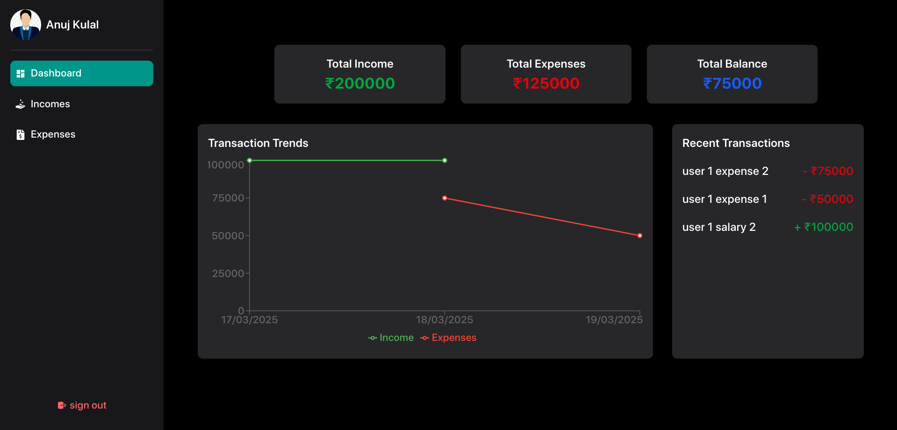

# Advanced Expense Tracker App

## Overview
The **Advanced Expense Tracker** is a full-stack web application built using the MERN stack (MongoDB, Express.js, React.js, Node.js). This app helps users efficiently manage their personal finances by tracking their income and expenses with insightful visualizations.

## Features
- **User Authentication**: Secure login and registration using JWT authentication.
- **Transaction Management**: Users can add, view, and delete income and expenses.
- **Graphical Representation**: Visualize financial data with charts for better analysis.
- **Data Persistence**: Transactions are stored in a MongoDB database.


## Tech Stack
- **Frontend**: React.js with Redux for state management
- **Backend**: Node.js with Express.js
- **Database**: MongoDB
- **Authentication**: JWT (JSON Web Tokens)
- **Charts**: Recharts for data visualization

## Installation

### Steps to Run the Project
1. **Clone the repository**
   ```sh
   git clone https://github.com/Anujkulal/Expense-Tracker.git
   cd Expense-Tracker
   ```

2. **Install dependencies**
   - Backend:
     ```sh
     cd server
     npm i
     ```
   - Frontend:
     ```sh
     cd ../client
     npm i
     ```

3. **Run the application**
   - Start the backend server:
     ```sh
     cd server
     npm start
     ```
   - Start the frontend server:
     ```sh
     cd client
     npm run dev
     ```


## Screenshots

  

## Contributing
Contributions are welcome! Feel free to fork the repository and submit pull requests.

## License
This project is licensed under the MIT License.

## Contact
For any queries, contact: 

[](mailto:anujkulal333@gmail.com)

